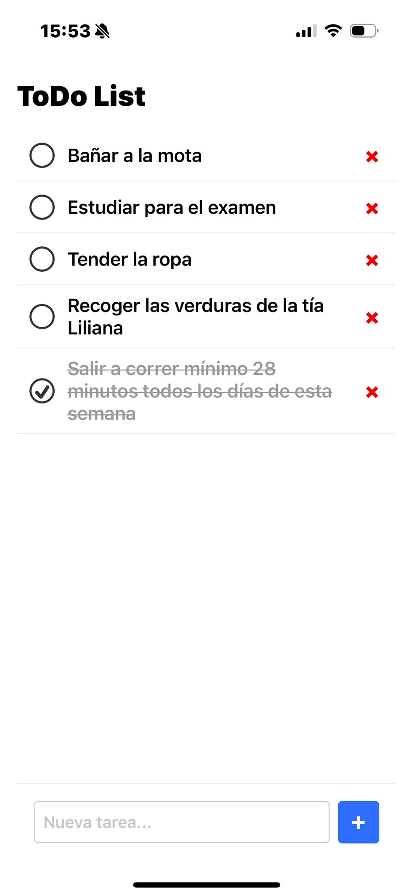
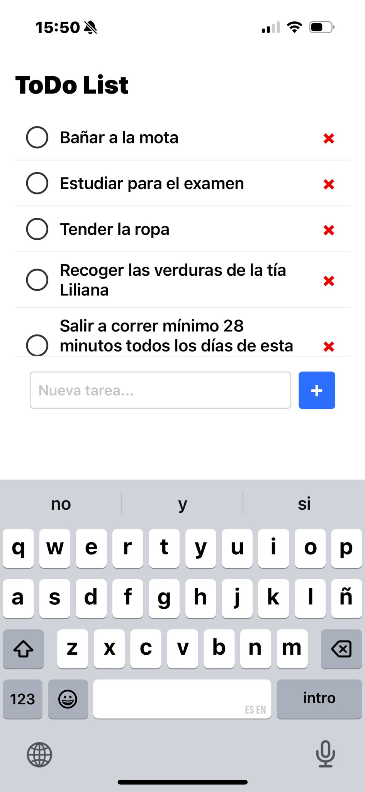

# ToDo List App

A simple mobile ToDo List application built with **React Native**, **Expo**, and **TypeScript**.

---

## 🏃 Getting Started

1. **Clone the repository**

   ```bash
   git clone https://github.com/LorenaGRB/my-todo-app.git
   cd my-todo-app
   ```

2. **Install dependencies**
   Using npm:

   ```bash
   npm install
   ```

   Or using yarn:

   ```bash
   yarn install
   ```

3. **Start the app**

   ```bash
   npx expo start
   ```

   - This will open Expo Developer Tools in your browser.
   - Scan the QR code with **Expo Go** on your mobile device, or press `i` to run on an iOS simulator or `a` for an Android emulator.

---

## 🛠 Technologies Used and Why

| Technology                         | Purpose                                           |
| ---------------------------------- | ------------------------------------------------- |
| **React Native**                   | Cross-platform mobile app framework.              |
| **Expo**                           | Simplifies development and deployment workflows.  |
| **TypeScript**                     | Statically typed language to catch errors early.  |
| **AsyncStorage**                   | Local persistence for storing tasks on device.    |
| **react-native-safe-area-context** | Handles safe area insets (notch, status bar).     |
| **KeyboardAvoidingView**           | Adjusts UI automatically when the keyboard opens. |

---

## 📸 Screenshots & Demo

**MAIN VIEW**



**ADD NEW TASK**



## 🚀 Future Improvements

- **Cloud Sync**: Integrate Firebase or a REST API for online backup of tasks.
- **Push Notifications**: Send reminders for pending tasks using `expo-notifications`.
- **Edit Tasks**: Allow users to update task text or due dates.
- **Filters & Search**: View tasks by status (pending/completed) and search by text.
- **UI/UX Enhancements**: Add animations for adding/removing tasks, support dark mode, and polish the design.
- **Testing**: Implement unit and integration tests with Jest and React Native Testing Library.
